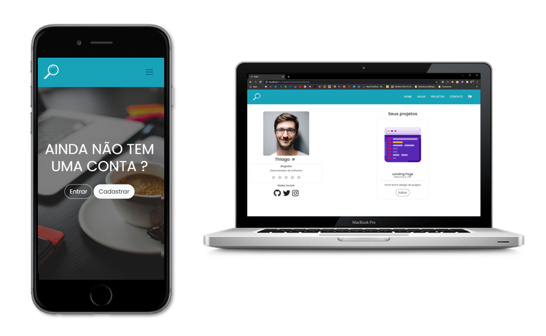

<h1 align="center">
TCC of the CPDB 2020 - FindJobs
</h1>

  <a href="#-Technology">Technology</a>&nbsp;&nbsp;&nbsp;|&nbsp;&nbsp;&nbsp;
  <a href="#-Project">Project</a>&nbsp;&nbsp;&nbsp;|&nbsp;&nbsp;&nbsp;
  <a href="#-Devs">Developers</a>&nbsp;&nbsp;&nbsp;|&nbsp;&nbsp;&nbsp;

   
   

  

 

## 🚀 Technology

This project was developed with the following technologies:

- [PHP](https://www.php.net/)
- [BOOTSRAP 4](https://getbootstrap.com/)
- [MYSQL](https://www.mysql.com/)

## 💻 Project

FindJobs is a platform for freelancers to find projects and study
